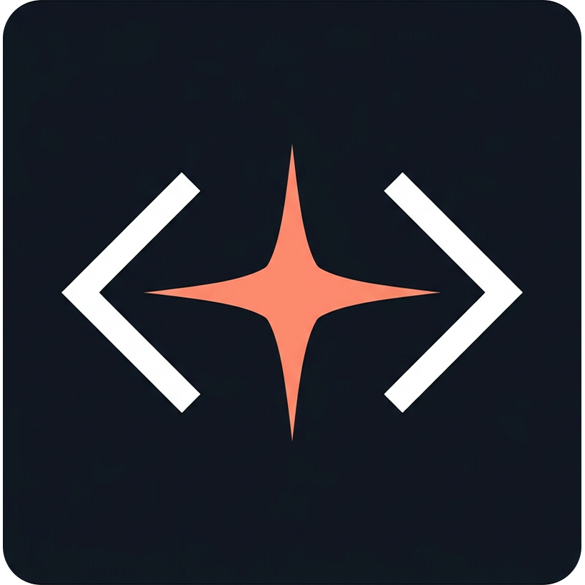

<div align="center">
  
  <h1>Claude Tools</h1>
  <p><b>A powerful, lightning-fast, and 100% offline desktop application</b> to manage multiple Claude Code CLI accounts — effortlessly switch profiles, monitor quota usage, and stay meticulously organized.</p>
</div>


## Features

- **Multi-account management** — Add, edit, and delete Claude Code CLI profiles
- **One-click switching** — Switch active account with confirmation dialog
- **Usage monitoring** — View quota and usage stats per profile
- **System tray** — Quick access from system tray icon
- **i18n** — English and Vietnamese language support
- **Dark mode** — Light/dark theme toggle

## 🔒 Security & Privacy (100% Local)

Because this application manages your `.credentials.json` files (which contain highly sensitive Claude API tokens), **Security is our top priority**:
- **Zero Telemetry & No Tracking**: We guarantee that the app **never** sends your credentials, tokens, or personal data to any external server.
- **100% Offline/Local Operation**: All file parsing, account switching, and management happen purely on your local filesystem using secure Rust bindings. Your API keys never leave your machine.
- **Open Source Transparency**: The codebase is completely open source, allowing you to audit and verify every single system call. You can trust this tool to protect your data.

## Tech Stack

| Layer | Technology |
|-------|------------|
| Frontend | React 19, TypeScript, Vite 7, Tailwind CSS 4 |
| Backend | Rust, Tauri v2 |
| UI | Radix UI, shadcn/ui, Lucide Icons |
| Package Manager | pnpm |

## Getting Started

### Prerequisites

- [Node.js](https://nodejs.org/) 22+
- [pnpm](https://pnpm.io/) 10+
- [Rust](https://rustup.rs/) (stable)
- Linux: system dependencies (see below)

### Linux System Dependencies

```bash
sudo apt-get install -y \
  libwebkit2gtk-4.1-dev \
  libappindicator3-dev \
  librsvg2-dev \
  patchelf \
  libssl-dev \
  libgtk-3-dev \
  libayatana-appindicator3-dev
```

### Install & Run

```bash
pnpm install
pnpm tauri:dev
```

### Build for Production

```bash
pnpm tauri build
```

## CI/CD

| Workflow | Trigger | Purpose |
|----------|---------|---------|
| **CI** | Push/PR to `main` | Build check on Linux, macOS, Windows |
| **Release** | Push tag `v*` | Build + create GitHub Release with installers |

### Creating a Release

```bash
# 1. Update version in package.json and src-tauri/tauri.conf.json
# 2. Commit and tag
git commit -am "chore: bump version to X.Y.Z"
git tag vX.Y.Z
git push origin main --tags
# 3. Review draft release on GitHub, then publish
```

See [docs/deployment-guide.md](docs/deployment-guide.md) for details.

## Project Structure

```
├── src/                    # React frontend
│   ├── components/         # UI components
│   ├── hooks/              # Custom React hooks
│   ├── lib/                # Utilities, types, i18n
│   ├── locales/            # Translation files (en, vi)
│   └── pages/              # Page components
├── src-tauri/              # Rust backend
│   └── src/
│       ├── commands/       # Tauri IPC commands
│       ├── tray.rs         # System tray
│       └── lib.rs          # App setup
├── .github/workflows/      # CI/CD pipelines
└── docs/                   # Project documentation
```
